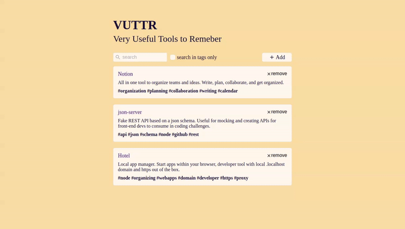

<h1 align="center">
 
VUTTR
</h1>

Very Useful Tools to Remember - BossaBox challenge

  

  

## Features

This app features all the latest tools and practices in development!

- ⚛️ **React Js** — A JavaScript library for building user interfaces
- 💹 **Node Js** — A web framework for Node Js
- 📄 **TypeScript** — Typed superset of JavaScript that compiles to plain JavaScript.

## Getting started

1. Clone this repo using `git clone https://github.com/thiagodff/VUTTR`
2. Move yourself to the appropriate directory: `cd VUTTR` 

### Getting started with the [backend server](https://vuttr-api-bossabox.herokuapp.com/)

1. Move yourself to the backend folder: `cd backend` 
2. Copy the .env.example `cp .env.example .env` 
3. Setup database settings inside `ormconfig.json` if you prefer 
4. Run `docker-compose up` to setup all your database and start services(be sure to have docker and docker-compose installed) 

### Routes

#### Insomnia

#### API Blueprint

Detailed documentation see [api.apib](https://github.com/thiagodff/VUTTR/blob/master/.github/api.apib) file.

To see a user friendly version use [html](https://htmlpreview.github.io/?https://github.com/thiagodff/VUTTR/blob/master/.github/api.html) version

### Getting started with the [frontend app](https://vuttr-bossabox.netlify.app/)

1. Move yourself to the frontend folder: `cd frontend` 
2. Run `yarn` to install dependencies 
3. Run `json-server -p 3333 db.json` to run fake REST API
4. Run `yarn start` to run the application

## License

This project is licensed under the MIT License - see the [LICENSE](https://opensource.org/licenses/MIT) page for details.

---

Made with ❤️ by <strong>Thiago</strong> :wave: <a href="https://www.linkedin.com/in/thiago-fernandes-dornelles">See my linkedin!</a>

